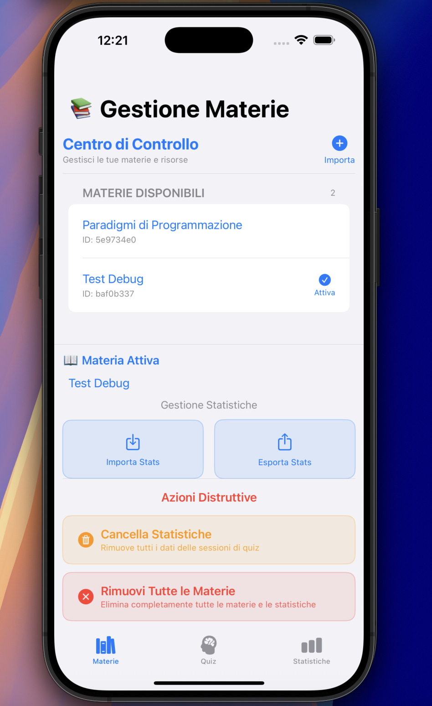
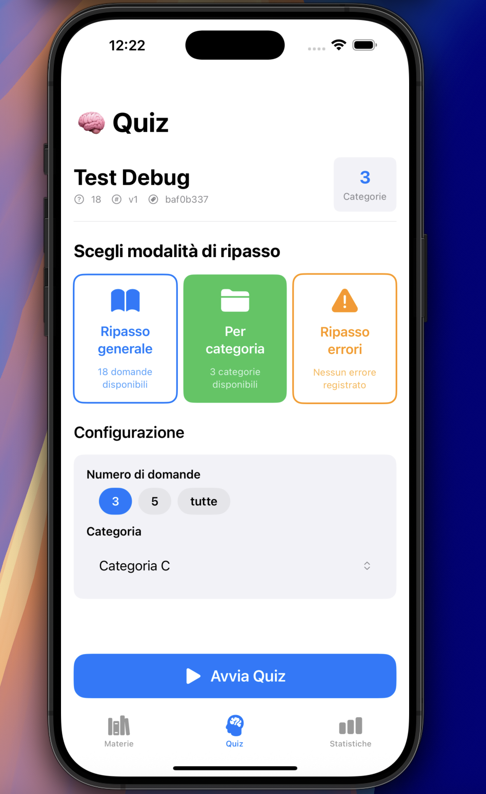
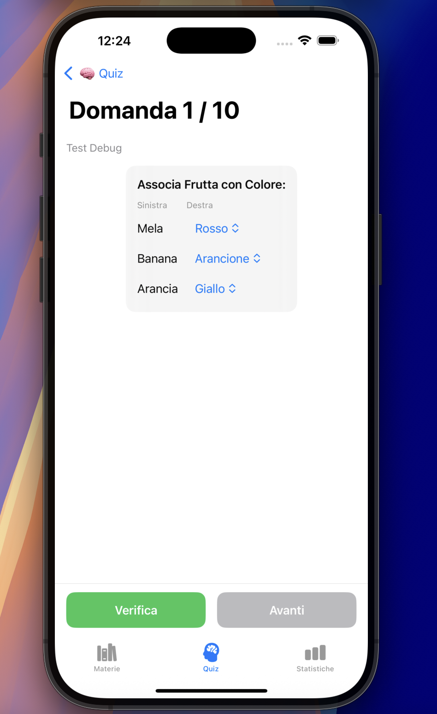
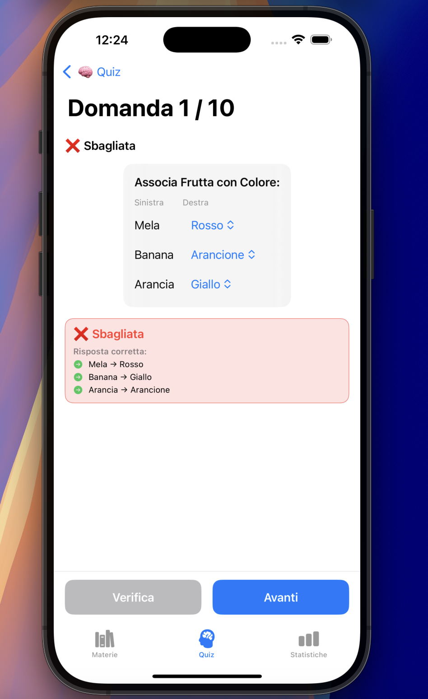
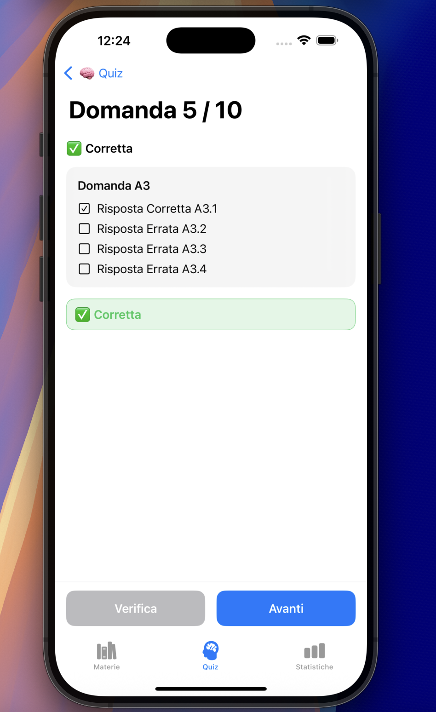
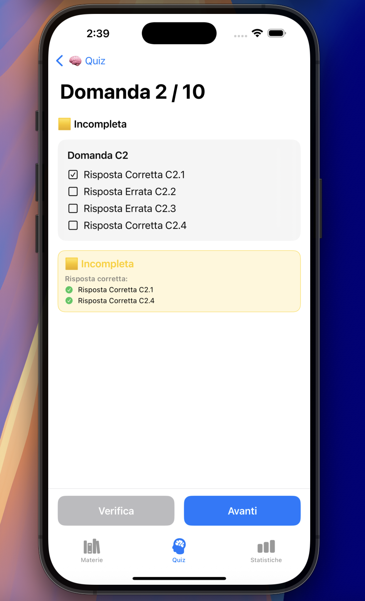
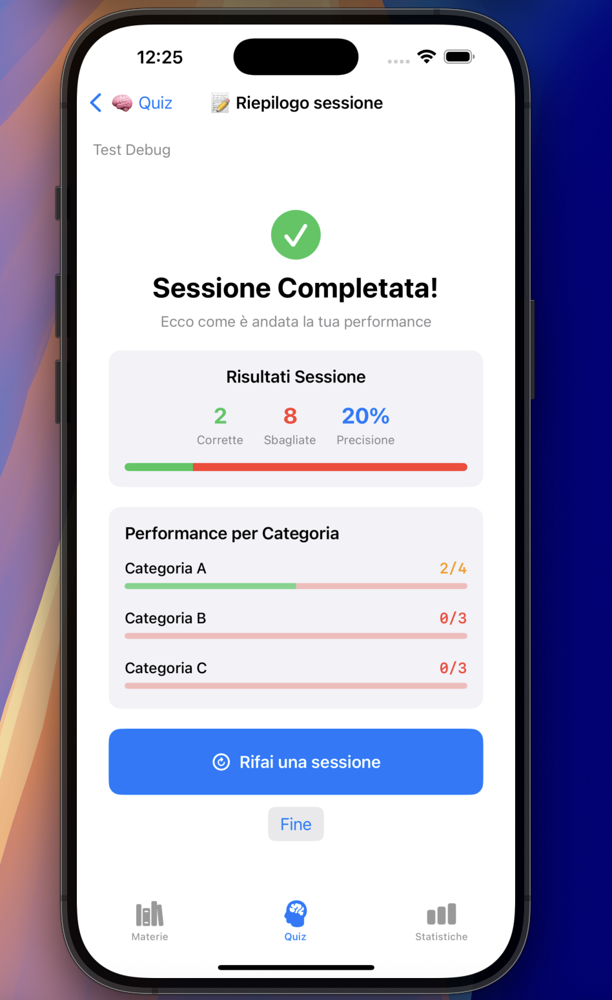
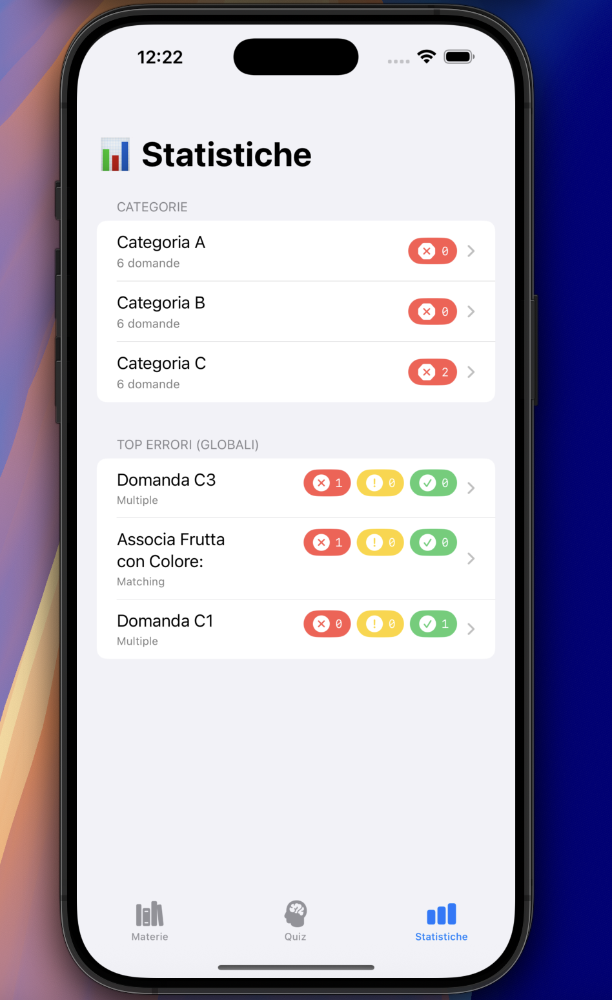
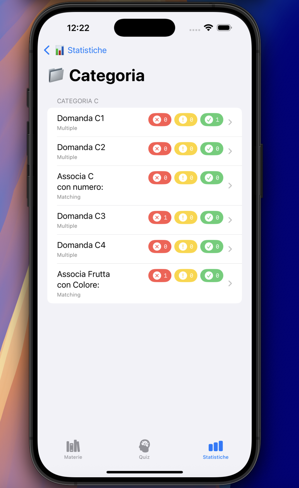
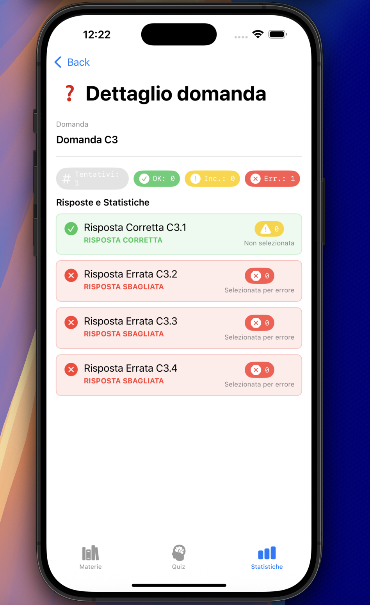

# QuizApp iOS

App per creare e fare quiz su iPhone e iPad. Importi i tuoi contenuti tramite file JSON e l'app ti fa le domande tenendo traccia di come va.

## Come funziona

Carichi le tue materie con file JSON, scegli che tipo di quiz fare e l'app tiene conto di come rispondi. Puoi fare domande a caso, concentrarti su una categoria o ripassare solo le domande sbagliate.

## Tour dell'App

### Gestione delle Materie
<div align="center">

</div>

Qui vedi tutte le materie che hai caricato. Selezioni quella su cui vuoi lavorare e parti da lì.

### Configurazione del Quiz
<div align="center">

</div>

Prima di iniziare scegli che tipo di quiz fare. Puoi fare domande a caso, solo di una categoria, oppure ripassare quelle che hai sbagliato.

### Domande Interattive di Collegamento
<div align="center">

</div>

L'app fa anche domande dove devi collegare due colonne. Tocchi per abbinare gli elementi tra di loro.

### Sistema di Feedback Immediato

#### Risposta Errata
<div align="center">

</div>

Quando sbagli, l'app ti dice subito qual era la risposta giusta. Non ti lascia solo con l'errore.

#### Risposta Corretta
<div align="center">

</div>

Le risposte giuste vengono confermate subito. Ti fa capire che hai fatto bene.

#### Risposta Incompleta
<div align="center">

</div>

Se una domanda ha più risposte corrette e ne metti solo alcune, l'app ti dice che manca qualcosa. Ti fa riflettere se c'è altro.

### Riepilogo della Sessione
<div align="center">

</div>

Finito il quiz vedi come è andata: punteggio, tipi di domande, categorie. Ti aiuta a capire su cosa lavorare la prossima volta.

### Dashboard delle Statistiche
<div align="center">

</div>

Le statistiche ti mostrano come stai andando. Vedi i progressi nel tempo e capisci dove devi studiare di più.

### Analisi per Categoria
<div align="center">

</div>

Puoi vedere come vai in ogni categoria della materia. Così capisci subito dove sei più bravo e dove devi insistere.

### Dettagli delle Singole Domande
<div align="center">

</div>

L'app ricorda ogni domanda: quante volte hai risposto giusto, quante sbagliate, quante incomplete. Ti aiuta a capire su cosa concentrarti.


## Come creare i contenuti JSON

L'app legge file JSON per avere le domande. Ogni materia è un file separato che puoi scrivere con qualsiasi editor di testo.

### Struttura di base

Ogni file JSON ha tre parti: il nome della materia, le categorie e le domande:

```json
{
  "subject": "Nome della tua materia",
  "categories": ["Prima categoria", "Seconda categoria"],
  "questions": [
    // Le domande vanno qui
  ]
}
```

### Domande a scelta multipla

Per fare domande con più opzioni di risposta:

```json
{
  "id": "domanda_001",
  "category": "Prima categoria",
  "kind": "multiple",
  "text": "Qual è la capitale della Francia?",
  "options": [
    {"id": 1, "text": "Londra", "isCorrect": false},
    {"id": 2, "text": "Parigi", "isCorrect": true},
    {"id": 3, "text": "Roma", "isCorrect": false}
  ]
}
```

### Domande di collegamento

Per fare domande dove abbini due colonne:

```json
{
  "id": "collegamento_001",
  "category": "Seconda categoria",
  "kind": "matching",
  "text": "Collega ogni paese con la sua capitale:",
  "left": ["Francia", "Italia", "Spagna"],
  "right": ["Parigi", "Roma", "Madrid"]
}
```

### Regole da seguire

Ogni domanda deve avere un ID unico nel file. Le categorie delle domande devono esistere nella lista delle categorie. Per le domande a scelta multipla serve almeno una risposta corretta. Per quelle di collegamento, le due colonne devono avere lo stesso numero di elementi e vanno in ordine (il primo della sinistra va con il primo della destra, eccetera).

L'app importa automaticamente tutti i file JSON che aggiungi al progetto. Metti i tuoi file nella cartella `quiz_app/Documents/` e verranno caricati al primo avvio.

## Installazione

Serve iOS 18.5 o più recente. Clona il repository, apri il progetto in Xcode, metti i tuoi file JSON nella cartella principale e compila l'app.

Licenza MIT - by subnetMusk.
