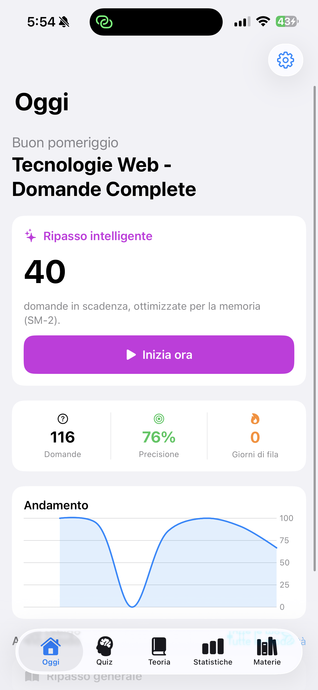
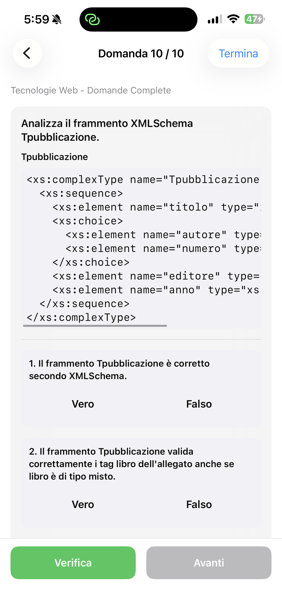
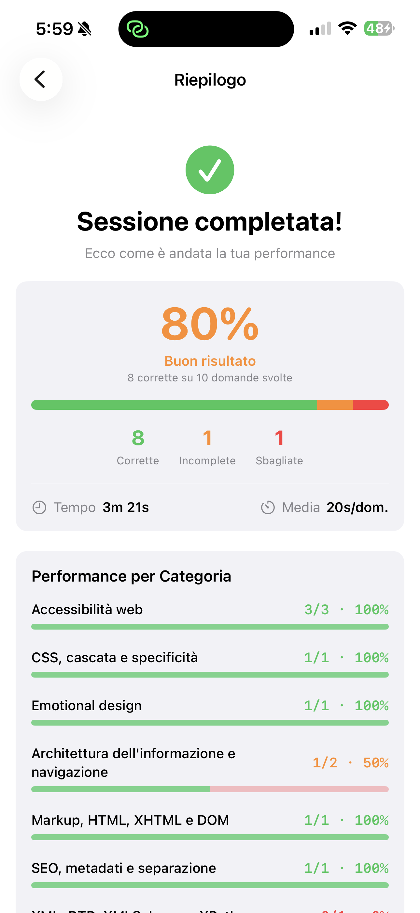
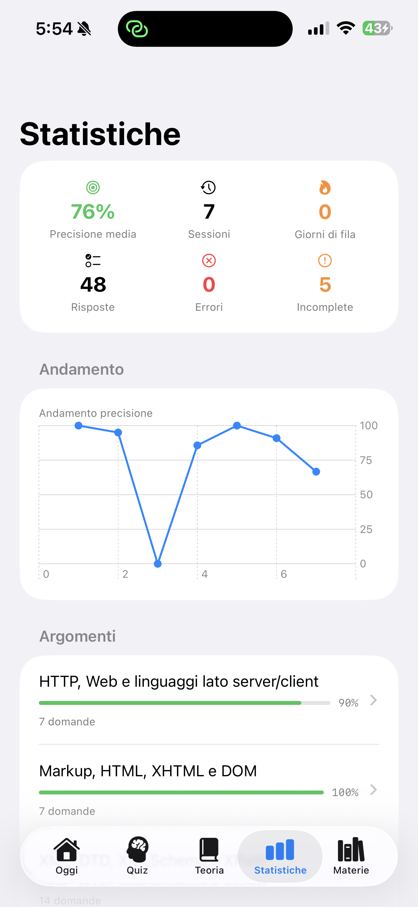
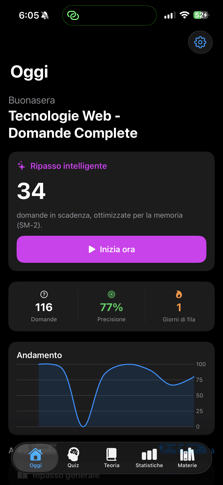
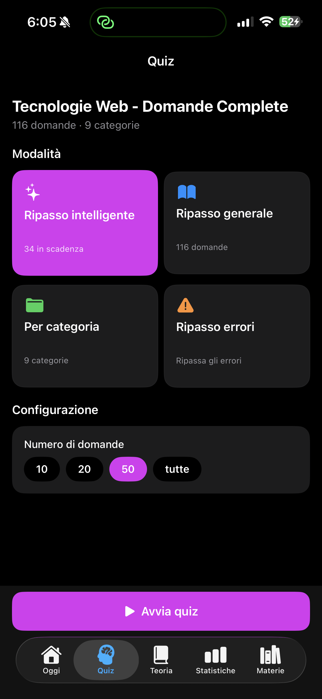
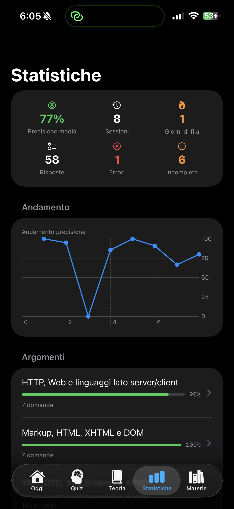
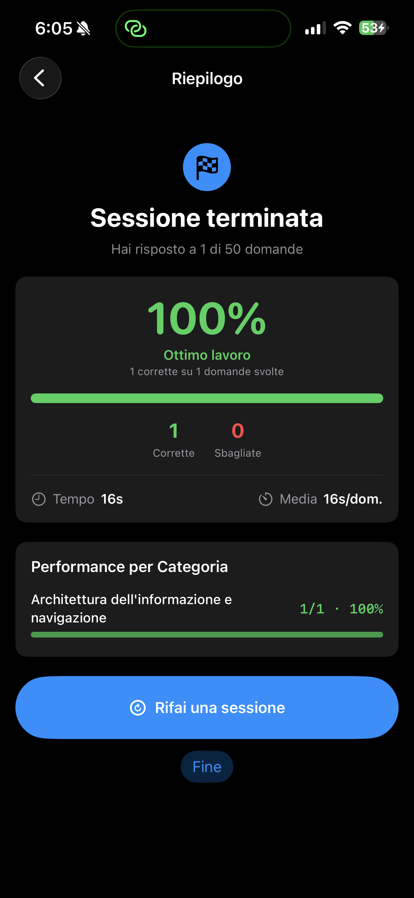

<div align="center">

# QuizApp iOS

**App di studio per iPhone e iPad.** Importi i tuoi contenuti via JSON e l'app ti fa quiz,
ti propone la teoria e ripropone le domande al momento giusto per fissarle in memoria.


</div>

---

## Indice

- [Come funziona](#come-funziona)
- [Tour dell'app](#tour-dellapp)
- [Crea i tuoi contenuti (JSON)](#crea-i-tuoi-contenuti-json)
- [Widget](#widget)
- [Tema scuro](#tema-scuro)
- [Installazione](#installazione)

---

## Come funziona

Carichi le tue materie con file JSON. Ogni materia porta con sé domande, tassonomia degli argomenti e (facoltativamente) la teoria. L'app organizza lo studio in cinque schede:

- **Oggi** — punto di partenza: ripasso intelligente con le domande in scadenza (ripetizione dilazionata), precisione media e giorni di fila.
- **Quiz** — scegli la modalità (ripasso intelligente, generale, per categoria o solo errori) e quante domande fare.
- **Teoria** — leggi i notebook per argomento, con percorso di studio guidato e avanzamento.
- **Statistiche** — andamento della precisione nel tempo, per sessione e per argomento.
- **Materie** — la libreria delle materie importate.

---

## Tour dell'app

<table>
<tr>
<td width="50%" align="center" valign="top">
<br/>
<strong>Oggi</strong><br/>
Il <strong>ripasso intelligente</strong> propone le domande in scadenza secondo l'algoritmo SM-2: le rivedi proprio quando stai per dimenticarle.
</td>
<td width="50%" align="center" valign="top">
<br/>
<strong>Modalità di quiz</strong><br/>
Scegli come allenarti — ripasso intelligente, generale, per categoria o solo errori — e quante domande fare.
</td>
</tr>
<tr>
<td width="50%" align="center" valign="top">
<br/>
<strong>Teoria — indice</strong><br/>
Un notebook per ogni argomento, con percorso guidato e avanzamento.
</td>
<td width="50%" align="center" valign="top">
<br/>
<strong>Teoria — lettura</strong><br/>
Testo in Markdown; da qui passi al quiz sull'argomento ("Allenati sulle domande chiave").
</td>
</tr>
<tr>
<td width="50%" align="center" valign="top">
<br/>
<strong>Feedback — errata</strong><br/>
Quando sbagli ti mostra subito la risposta giusta e perché le altre non andavano bene.
</td>
<td width="50%" align="center" valign="top">
<br/>
<strong>Feedback — corretta</strong><br/>
Le risposte giuste vengono confermate subito, con la motivazione.
</td>
</tr>
<tr>
<td width="50%" align="center" valign="top">
<br/>
<strong>Casi di studio</strong><br/>
Uno stimolo comune — codice, testo o media — seguito da più sotto-domande collegate.
</td>
<td width="50%" align="center" valign="top">
<br/>
<strong>Riepilogo sessione</strong><br/>
Punteggio, tempo, media per domanda e prestazione per categoria a fine quiz.
</td>
</tr>
<tr>
<td colspan="2" align="center" valign="top">
<br/>
<strong>Statistiche</strong><br/>
Andamento nel tempo: precisione media, sessioni, giorni di fila e dettaglio per argomento.
</td>
</tr>
</table>

---

## Crea i tuoi contenuti (JSON)

L'app legge file JSON per avere i contenuti. Ogni materia è un file separato che puoi scrivere con qualsiasi editor di testo.

### Struttura di base

Ogni file ha quattro parti obbligatorie — `meta`, `config`, `taxonomy`, `questions` — e una facoltativa, `theory`:

```json
{
  "meta": {
    "subject_id": "auto:sha256",
    "subject_name": "Nome della tua materia",
    "version": 1
  },
  "config": {
    "scales_questions": [10, 20, 50, "all"],
    "scales_category": [5, 10, 20, "all"],
    "scales_errors": [5, 10, 20, "all"],
    "feedback": "immediate"
  },
  "taxonomy": [
    { "id": "argomento_1", "name": "Primo argomento" },
    { "id": "argomento_2", "name": "Secondo argomento" }
  ],
  "questions": [
    // Le domande vanno qui
  ],
  "theory": [
    // Notebook di teoria (facoltativo)
  ]
}
```

- `meta.subject_id` può essere lasciato a `"auto:sha256"`: l'app lo deriva dal contenuto del file.
- `config.scales_*` sono gli scaglioni per "quante domande" mostrati nelle varie modalità (`"all"` = tutte).
- `taxonomy` elenca gli argomenti; ogni domanda deve riferirsi a un `id` presente qui (campo `category`).

### Le domande

Ogni domanda ha sempre `id` (unico nel file), `category` (un `id` della tassonomia), `kind` e `prompt`. I tipi supportati (`kind`) sono:

| `kind` | Descrizione |
|---|---|
| `multiple` | Scelta multipla (una o più risposte corrette) |
| `matching` | Abbinamento tra due colonne |
| `trueFalseMotivated` | Vero/Falso con motivazione da scegliere |
| `clozeWordBank` | Testo bucato con banca di parole |
| `shortAnswer` | Risposta breve testuale |
| `ordered` | Riordino di elementi |
| `calculation` | Calcolo con tolleranza numerica |
| `openRubric` | Risposta aperta valutata su rubrica (formativa) |
| `constructedResponse` | Produzione guidata su criteri (formativa) |
| `mediaAnalysis` | Analisi di un media con sotto-domande |
| `caseStudy` | Caso di studio: stimolo comune + più sotto-domande |

Esempio a scelta multipla:

```json
{
  "id": "domanda_001",
  "category": "argomento_1",
  "kind": "multiple",
  "prompt": "Qual è la capitale della Francia?",
  "options": [
    { "id": 1, "text": "Londra", "isCorrect": false },
    { "id": 2, "text": "Parigi", "isCorrect": true },
    { "id": 3, "text": "Roma", "isCorrect": false }
  ]
}
```

Esempio Vero/Falso motivato:

```json
{
  "id": "domanda_002",
  "category": "argomento_1",
  "kind": "trueFalseMotivated",
  "prompt": "Il metodo GET invia i parametri nella query string.",
  "answer": true,
  "optionPool": {
    "displayCount": 4,
    "correctCountRange": { "min": 1, "max": 3 },
    "allowDuplicateConcepts": false,
    "entries": [
      { "id": "d002_c1", "text": "I dati sono nell'URL e quindi riapribili.", "isCorrect": true },
      { "id": "d002_w1", "text": "GET cifra sempre i parametri.", "isCorrect": false }
    ]
  }
}
```

Per il dettaglio degli altri tipi, i file in [`quiz_app/Documents/`](quiz_app/Documents/) sono esempi completi e funzionanti da cui partire; gli script in [`scripts/`](scripts/) mostrano come generarli e arricchirli (es. struttura guidata della teoria).

> Le domande aperte (`openRubric`, `constructedResponse`) sono **formative**: mostrano una rubrica di autovalutazione ma non producono un esito e non rientrano nelle statistiche di precisione.

### La teoria (facoltativa)

Ogni voce di `theory` è un notebook agganciato a un argomento tramite `categoryId` (lo stesso `id` della tassonomia):

```json
{
  "categoryId": "argomento_1",
  "title": "Titolo dell'argomento",
  "intro": "Riga introduttiva breve.",
  "body": "Corpo completo in **Markdown**.",
  "sections": [
    { "id": "sez_1", "title": "Sezione", "summary": "Anteprima", "body": "Testo in Markdown." }
  ],
  "estimatedMinutes": 8
}
```

Le `sections` ordinate alimentano il **percorso di studio guidato**; `body` è la versione integrale leggibile con "Leggi tutto".

### Caricamento

L'app importa automaticamente tutti i file JSON presenti nella cartella `quiz_app/Documents/`: aggiungili lì e verranno caricati all'avvio.

---

## Widget

L'app include un widget per la home **"Ripasso del giorno"**, che mostra il numero di domande in scadenza. Target ed App Group sono già configurati nel progetto: vedi [WIDGET_SETUP.md](WIDGET_SETUP.md) per i dettagli.

---

## Tema scuro

L'app segue di default l'aspetto di sistema e puoi forzare chiaro o scuro dalle impostazioni. Il tema scuro è curato e vale la pena provarlo.

<div align="center">



</div>

<div align="center">



</div>

---

## Installazione

Serve iOS 18.5 o più recente. Clona il repository, apri il progetto in Xcode, metti i tuoi file JSON in `quiz_app/Documents/` e compila lo schema `quiz_app`.

---

<div align="center">

Licenza MIT — by **subnetMusk** · vedi [DISCLAIMER](DISCLAIMER.md) per le fonti dei contenuti.

</div>
